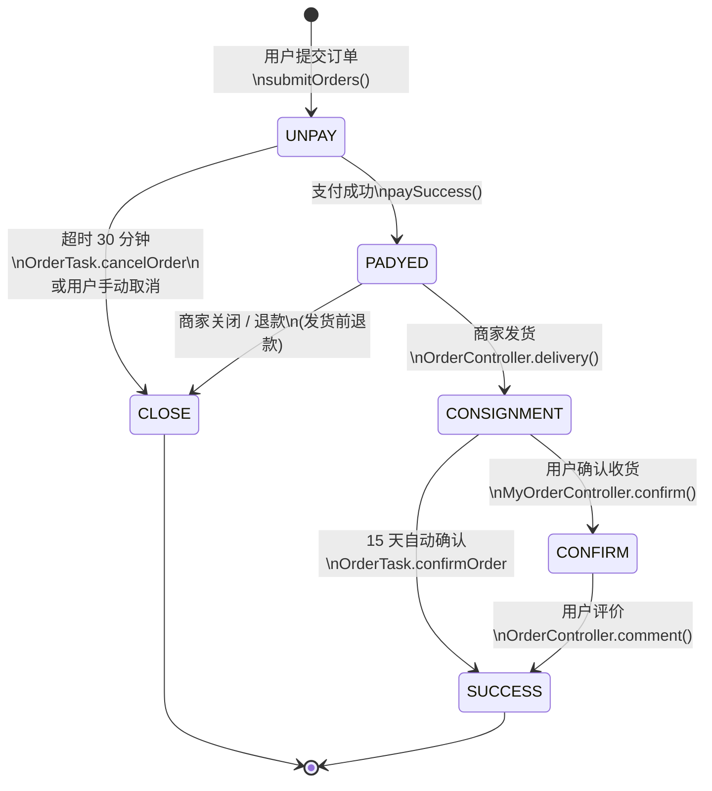

# 第 2 课：三流合一（资金 / 信息 / 物流）+ 订单状态机

> **本课 Mission**：用 5 分钟讲清"一笔订单的钱、消息、物件分别怎么走"，并能用一句话说清每个订单状态由谁触发。
> **读者画像**：双非本科大四 / Java + Python 基础 / 零实习 / 主攻测开 / 已学完第 1 课。
> **本课范围**：聚焦"订单生命周期"这一段——从用户下单到交易关闭，配套状态机迁移表 + 三流测试切入点。
> **前置依赖**：第 1 课业务全貌（七模块、主链路、五流框架）。
> **ZPD**：本课深化"五流"里的资金 / 信息 / 物流三条；配置流 / 数据流放到第 4 课。

---

## 1. 一句话回顾（第 1 课的关键点）

第 1 课讲了三件事：

1. mall4j 是 B2C 单商户电商，`yami-shop-api`(:8086) + `yami-shop-admin`(:8085) 两套后端分别服务用户端与管理端。
2. 主链路是 `商品/SKU → 加购 → 确认订单 → 提交订单 → 支付 → 后台发货` 六步。
3. 业务要测"流"，不要测"点"——任何孤立用例都是反模式。

**本课的承诺**：把"流"这层抽象落成"一笔订单的钱、消息、物件分别怎么走"+ 6 个状态各自由谁触发。掌握这两张图，第 3 课就能直接进入退款链路的接口自动化。

---

## 2. 三流合一定义（资金流 / 信息流 / 物流的起中终）

来源：`CONTEXT.md` 第 6-14 行。术语统一：

| 流 | 起点 | 中间点 | 终点 | 测试切入关键词 |
|---|---|---|---|---|
| **资金流** | 用户点击支付 | 支付网关 / 商家结算系统 | 商家收款 / 退款原路返回 | 支付回调幂等、退款链路、`tz_order_settlement.pay_amount` |
| **信息流** | 用户提交订单 | 商家后台订单列表 / 仓库拣货系统 | 用户侧消息推送（短信 / 站内信） | 状态同步、缓存刷新、事件总线（`PaySuccessOrderEvent`） |
| **物流** | 商家后台发货 | 物流公司（快递 100 / 顺丰 / 中通） | 用户签收 | 物流单号回填、`dvy_flow_id` 字段、自动确认收货 |

**关键判断**：三流不是三条平行线，而是**同一笔订单的三个观察面**。一笔订单的钱（资金流）、消息（信息流）、物件（物流）必须**同步前进**，任意一面卡住都会触发订单状态机迁移。

**反模式**：测"支付接口能调通"——单点通过，但若商家后台没看到订单（信息流断）/ 没生成物流单（物流流断），业务整体还是坏的。

---

## 3. 资金流深挖（支付 → 商家结算 → 退款原路返回）

来源：`doc/6-核心业务/6-支付流程.md` + `doc/7-数据模型/6-订单数据模型.md`。

```text
用户点击支付
   │
   ▼
PayController.normalPay()
   │  生成 payNo（统一支付流水）
   │  读取 tz_order_settlement.pay_amount（不接受前端金额）
   ▼
开源版直接调用 paySuccess()    ← 注意：本地跑通用，生产不能这么写
   │
   ▼
OrderSettlementMapper.updateToPay()  乐观锁 version+1
   │
   ▼
tz_order.status 1→2（待付款 → 待发货）
   │
   ▼
发布 PaySuccessOrderEvent（事件总线扩展点）
```

**退款原路返回**（来源：`yami-shop-bean/.../model/OrderRefund.java` + `OrderRefundParam.java`）：

```text
用户发起退款（applyType=1 仅退款 / 2 退款退货）
   │
   ▼
写入 tz_order_refund（refundSts 处理中）
   │
   ▼
商家审核 → 同意 / 拒绝
   │
   ▼
同意后：
   - 仅退款：直接调用第三方退款接口
   - 退款退货：等用户回寄物流单 → 商家收货 → 触发退款
   │
   ▼
调用第三方退款（原路返回 pay_type 对应的渠道）
   │
   ▼
更新 tz_order_refund.returnMoneySts = 1（成功）
   │
   ▼
若整单退款：tz_order.status = 6（关闭）+ refund_sts 更新
```

**支付幂等三道关**（写用例时必查）：

1. 同一订单号二次支付：`PayServiceImpl` 会按 `payNo` 读取结算表，重复请求被乐观锁拦截。
2. 同一支付回调多次到达：`PayNoticeController` 当前是注释状态，二开必须补齐验签 + 幂等。
3. 已支付订单再次点击支付：开源版会再次触发 `paySuccess()`，需要依赖上层订单状态校验拦截。

**测开面试金句**：*金额看 `tz_order_settlement`，不信前端传；幂等靠 `payNo` + 数据库乐观锁双重保险。*

---

## 4. 信息流深挖（用户下单 → 商家后台 → 仓库拣货 → 消息推送）

来源：`doc/6-核心业务/5-提交订单.md` + `yami-shop-api/.../listener/SubmitOrderListener.java`。

```text
OrderController.submitOrders()
   │
   ▼
读取 ConfirmOrderCache（userId → 确认订单快照）
   │
   ▼
发布 SubmitOrderEvent
   │
   ▼
SubmitOrderListener.defaultSubmitOrderListener()  @Order(DEFAULT)
   │  按店铺拆单（一个店铺一个订单）
   │  生成 orderNumber（Snowflake，非 DB 主键）
   │  写入 UserAddrOrder（地址快照，不只存地址 ID）
   ▼
批量保存：tz_order + tz_order_item + tz_order_settlement + tz_user_addr_order
   │
   ▼
清理缓存：商品缓存 + SKU 缓存 + 购物车缓存 + ConfirmOrderCache
   │
   ▼
返回 orderNumbers 给前端
   │
   ▼
商家后台：管理端 OrderController 列表查询看到新订单
   │
   ▼
仓库拣货：状态停留在 2（待发货）直到商家发货
```

**地址快照的意义**（来源：`doc/6-核心业务/5-提交订单.md` 第 38 行）：下单后用户改收货地址，**不影响**已提交订单。测试时用 `tz_user_addr_order` 对照用户地址簿，验证快照正确性。

**信息流测试陷阱**：

- 缓存清理失败 → 重复下单导致库存超卖（虽然 SQL 条件更新兜底，但缓存不一致会让用户看到"已下单"但实际库存为 0）。
- 事件监听器异常 → 订单已写入但后续逻辑（清理缓存、发消息）失败，需补偿机制。
- 商家后台查询延迟 → 用户已支付，商家 30 秒后才看到，运营事故。

---

## 5. 物流深挖（商家发货 → 物流公司 → 用户签收）

来源：`doc/6-核心业务/7-订单管理.md` + `OrderTask.java`。

```text
管理端 OrderController.delivery()
   │
   ▼
填写 dvy_id（物流公司）+ dvy_flow_id（物流单号）
   │
   ▼
tz_order.status 2→3（待发货 → 待收货）
   │
   ▼
tz_order.dvy_time = NOW()
   │
   ▼
物流公司对接（开源版未对接，由用户 / 商家手动回填单号）
   │
   ▼
用户主动点击"确认收货"
   │
   ▼
tz_order.status 3→4（待收货 → 待评价）
   │
   ▼
用户评价
   │
   ▼
tz_order.status 4→5（待评价 → 成功），product_count +1
```

**自动确认收货**（来源：`OrderTask.java:71-88`）：管理端 XXL-JOB 定时任务 `confirmOrder` 每 15 天扫一次 `status=3` 的订单，自动 `status=3→5`。这意味着"已发货"15 天后即使用户不点确认收货，系统也会自动结单。

**物流流测试陷阱**：

- 物流单号格式校验（不同物流公司单号长度 / 前缀不同）。
- 重复发货：发货按钮防重点（管理端需要按订单号锁定）。
- 自动确认收货定时任务边界：15 天阈值是否可配置；订单在 14 天时人工确认收货是否能正常迁移。

---

## 6. 订单状态机（6 个状态全图）

来源：`yami-shop-bean/.../enums/OrderStatus.java` + `doc/7-数据模型/6-订单数据模型.md` 第 73-78 行。

| 状态值 | 枚举名 | 中文 | 数据库 `tz_order.status` |
|---|---|---|---|
| 1 | `UNPAY` | 待付款 | 1 |
| 2 | `PADYED` | 待发货 | 2 |
| 3 | `CONSIGNMENT` | 待收货 | 3 |
| 4 | `CONFIRM` | 待评价 | 4 |
| 5 | `SUCCESS` | 成功 | 5 |
| 6 | `CLOSE` | 失败或关闭 | 6 |



**注意**：开源版没有"退款中"这个独立状态——退款走的是 `tz_order_refund` 子表，`tz_order.status` 仍可能是 3（待收货，退货中）或 6（已关闭，整单退）。

---

## 7. 状态迁移触发条件表（核心交付物）

这是本课"具体可验证的 win"——把这张表抄进自己的笔记本，面试官问"订单状态怎么转"时直接画：

| 起始状态 | 目标状态 | 触发动作 | 触发方 | 代码入口 | 副作用 |
|---|---|---|---|---|---|
| — (无) | UNPAY (1) | 用户提交订单 | 用户 | `OrderController.submitOrders` | 写 `tz_order`、扣减库存 |
| UNPAY (1) | PADYED (2) | 支付成功 | 用户 / 系统 | `PayController.normalPay` | 更新 `tz_order_settlement`、发 `PaySuccessOrderEvent` |
| UNPAY (1) | CLOSE (6) | 超时未支付（30 分钟） | 系统 | `OrderTask.cancelOrder` | 还原库存、清理缓存 |
| UNPAY (1) | CLOSE (6) | 用户手动取消 | 用户 | `MyOrderController.cancel` | 还原库存、清理缓存 |
| PADYED (2) | CONSIGNMENT (3) | 商家发货 | 商家 | 管理端 `OrderController.delivery` | 写 `dvy_id` + `dvy_flow_id`、`dvy_time = NOW()` |
| PADYED (2) | CLOSE (6) | 发货前整单退款 | 商家 / 用户 | `RefundController.agree` | 退款走第三方、库存扣减保留 |
| CONSIGNMENT (3) | CONFIRM (4) | 用户确认收货 | 用户 | `MyOrderController.confirm` | `finally_time = NOW()` |
| CONSIGNMENT (3) | SUCCESS (5) | 15 天自动确认 | 系统 | `OrderTask.confirmOrder` | 跳过评价直接结单 |
| CONFIRM (4) | SUCCESS (5) | 用户评价 | 用户 | `OrderController.comment` | `product_count +1`（商品销量） |

**测开用法**：每个状态迁移至少有 3 条用例——正常路径、异常路径（非法前置状态）、幂等路径（重复触发）。

---

## 8. 订单自动取消 / 自动确认收货任务（OrderTask）

来源：`yami-shop-admin/.../task/OrderTask.java`（完整 90 行）。

```java
@XxlJob("cancelOrder")
public void cancelOrder() {
    Date now = new Date();
    // 扫 30 分钟前 status=1 且未支付的订单
    List<Order> orders = orderService.listOrderAndOrderItems(
        OrderStatus.UNPAY.value(),
        DateUtil.offsetMinute(now, -30)
    );
    if (CollectionUtil.isEmpty(orders)) return;
    orderService.cancelOrders(orders);  // SQL: status=6, cancel_time=NOW()
    // 清理商品 + SKU 缓存
}
```

```java
@XxlJob("confirmOrder")
public void confirmOrder() {
    Date now = new Date();
    // 扫 15 天前 status=3 的订单
    List<Order> orders = orderService.listOrderAndOrderItems(
        OrderStatus.CONSIGNMENT.value(),
        DateUtil.offsetDay(now, -15)
    );
    if (CollectionUtil.isEmpty(orders)) return;
    orderService.confirmOrder(orders);  // SQL: status=5, finally_time=NOW()
    // 清理商品 + SKU 缓存
}
```

**关键设计**：

- 两个定时任务都用 `orderService.listOrderAndOrderItems()` 扫表，传 `update_time < ?` 做时间窗。
- 时间阈值硬编码（30 分钟 / 15 天），**配置文件里没暴露**——二开要点。
- XXL-JOB 配置在 `application-dev.yml` 和 `application-docker.yml`，本地启动需先跑 XXL-JOB Admin。
- 任务执行后清理商品 / SKU 缓存，避免脏数据。

**测试切入点**：

1. 阈值边界：订单 `update_time` 在 29 分 59 秒 / 30 分 01 秒 / 14 天 23 时 59 分 / 15 天 00 分 01 秒。
2. 并发：同一订单被两个定时任务实例同时扫到（XXL-JOB 调度路由要保证单实例执行）。
3. 失败补偿：定时任务异常后下一次是否能重试（XXL-JOB 失败策略）。

---

## 9. 三流测试切入映射（哪些点最容易爆雷）

| 流 | 高风险接口 | 关键测试点 | 典型 Bug 模式 |
|---|---|---|---|
| **资金流** | `PayController.normalPay` | 金额不被前端覆盖、回调幂等、乐观锁 | 前端传 0.01 元 → 实际支付金额被 DB 兜住 |
| **资金流** | `PayNoticeController` | 验签、幂等 token、重复回调 | 同笔回调触发两次退款 |
| **资金流** | 退款接口 | 仅退款 vs 退款退货分支、原路返回 | 微信订单退到支付宝 |
| **信息流** | `OrderController.submitOrders` | 缓存一致性、地址快照、库存条件更新 | 用户改地址影响历史订单 |
| **信息流** | `ConfirmOrderCache` | 缓存过期、二次确认订单 | "订单已过期，请重新下单" |
| **信息流** | `OrderController.confirm` | 事件监听器异常处理 | 库存扣了但订单没写 |
| **物流** | 管理端发货 | 物流单号格式校验、重复发货 | 单号错填导致用户查不到物流 |
| **物流** | `OrderTask.confirmOrder` | 15 天阈值、并发执行 | 用户第 14 天想退款，订单已被自动结单 |

**面试答法**（3 句话）：*测资金流先抓金额源头（`tz_order_settlement`）+ 回调幂等；测信息流先抓事件总线 + 缓存清理；测物流先抓发货防重 + 自动确认收货阈值。*

---

## 10. 课堂小测（3 道单选）

1. 一笔订单的资金流终点（不考虑退款）应理解为？
- A) 用户钱包被扣款视为本次资金流的完整结束位置节点
- B) 商家在结算账户收到本次应结货款完整结束位置节点
- C) 系统调 paySuccess 即视为资金流结束
- D) 结算表 pay_status 被改写即记账结束

2. 订单状态机里，从"待发货"（status=2）迁移到"待收货"（status=3）由谁触发？
- A) 用户在用户端点击确认收货按钮触发订单状态完整迁移流程节点位置标识
- B) 支付调 paySuccess触发订单状态完整迁移流程节点位置标识
- C) 商家在管理端填物流公司与单号触发订单状态完整迁移流程节点位置标识
- D) OrderTask 扫描任务触发订单状态完整迁移流程节点位置标识

3. 自动确认收货定时任务 OrderTask.confirmOrder 的执行扫描条件是？
- A) 扫描 30 分钟前 status=1 未支付订单触发自动取消流程
- B) 扫描 7 天前 status=3 已发货订单触发自动确认收货流程
- C) 扫 15 天前 status=3 已发货订单触发自动确认收货流程
- D) 扫描 24 小时前 status=4 待评价订单触发自动关闭流程

---

## 11. 下一步：模块边界与可测点

本课建立了订单生命周期的"流 + 状态机"心智模型。第 3 课将进入：

- **模块边界图**：在白板上画出 `yami-shop-api`（用户端）vs `yami-shop-admin`（管理端）vs `front-end/mall4v`（管理后台前端）的接口归属——把"哪个 Controller 在哪个模块"画清楚。
- **可测点清单**：从每个模块里独立挑出 ≥ 3 个可测点，对应到等价类 / 边界值 / 场景法 / 状态迁移中的至少一种方法。
- **第一份接口用例**：登录 → 加购 → 下单 → 支付，用 Postman / Knife4j 跑通最小闭环，把第 2 课的状态机跑实一次。

**本课 win 验证**：你能在 5 分钟内画完第 7 节的 9 行状态迁移表，并说出每行触发方 + 代码入口——这就是 MISSION.md 里的"1500 字状态机迁移与幂等保证"的素材。

**预习**（可选）：读 `doc/6-核心业务/5-提交订单.md` 第 33-42 行关键设计部分，带着"为什么订单要按店铺拆单"的疑问进第 3 课。

---

## 附录：答案

1. B
2. C
3. C
