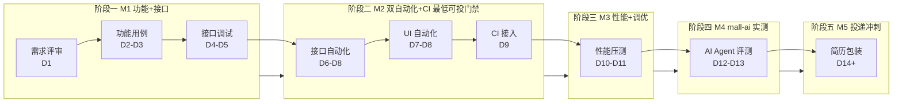

# 第 5 课：测试开发全流程图（收官）——14 天端到端流程地图 + 每步交付物 + 简历话术

> **本课 Mission**：让用户能用一张图讲清"我每天 5 小时，14 天做了什么，每一步产出什么"。
> **读者画像**：双非本科大四 / Java + Python 基础 / 零实习 / 主攻测开 / 已学完第 1~4 课。
> **本课范围**：本系列**收官课**。把前 4 课建立的业务心智（三流 / 状态机 / 边界图 / 方法论）拼回完整的端到端流程地图，每一步明确"输入 → 动作 → 输出 → 工具 → 简历可写句"。
> **前置依赖**：第 1 课业务全貌；第 2 课三流合一与订单状态机；第 3 课模块边界图与可测点；第 4 课用例设计方法论（等价类/边界值/场景法/状态迁移）。
> **ZPD**：本课不再展开任何新概念，只把已有概念挂到时间轴与里程碑门禁上，给出"立刻能开干"的 M1-D1 启动清单。
> **Mission 锚点**：本课是 5 课系列的收官——讲完这一课，用户应当可以合上笔记本，按 M1-D1 启动 mall4j。

---

## 1. 一句话回顾（前 4 课的连接）

前 4 课搭了 4 块心智拼图，本课把它们拼回一张时间轴地图：

- **第 1 课（业务全貌）**：mall4j 是 B2C 单商户电商，`yami-shop-api`(:8086) + `yami-shop-admin`(:8085) 双后端；五流贯通 + 七模块；主链路 `商品/SKU → 加购 → 确认 → 提交 → 支付 → 后台发货`。
- **第 2 课（三流 + 状态机）**：一笔订单的钱（资金流）/ 消息（信息流）/ 物件（物流）必须同步前进；订单 6 个状态（UNPAY/PADYED/CONSIGNMENT/CONFIRM/SUCCESS/CLOSE）的 9 条迁移路径，每条都有触发方与代码入口。
- **第 3 课（模块边界 + 可测点）**：`yami-shop-api` 与 `yami-shop-admin` 接口各管各的；每个模块至少 3 个可测点，对应等价类/边界值/场景法/状态迁移四种方法之一。
- **第 4 课（用例方法论）**：等价类（输入域划分）/ 边界值（边界 +1 -1）/ 场景法（业务流串联）/ 状态迁移（合法迁移 + 非法迁移）——四种方法按模块特性选配。

**本课的承诺**：把这 4 块拼图挂到一张端到端流程图上——从"读启动文档"到"GitHub 三个仓库 + 简历 v3"，每一步告诉你**今天输入什么、做什么动作、产出什么文件、用什么工具、简历怎么写**。读完后用户应当能用一张图讲清 14 天（v3.0 里程碑驱动版本不设死线）的全部故事。

---

## 2. 端到端流程图（Mermaid：从需求评审到简历投递）

来源：`PROJECT_TARGET_BOOK.md` 第四章 D1-D14（v3.0 里程碑驱动完整版）+ 第九章阶段→简历对照表。



**关键判断（v3.0 修订）**：
- **不是 14 天死线**：v3.0 起解除硬性日历，里程碑驱动，建议每天 5h，可弹性压缩或拉长。
- **M2 是最低可投状态**：D6-D9 接口 80+ 用例 + UI 12 场景 + GitHub Actions 绿勾完成即可**滚动投递日常实习**，不等"完美"。
- **M5 与 M2-M4 并行**：M2 达成后投递与后续阶段并行推进，秋招（2026-09~11）/ 春招（2027-02~04）节点自然对齐。

---

## 3. 七大阶段速查表（每阶段：输入 / 动作 / 输出 / 工具 / 简历可写句）

来源：`PROJECT_TARGET_BOOK.md` 第四章 D1-D14 + 第九章阶段→简历对照表。**这张表是本课的核心交付物**——遇到"今天该干什么"先查这张表。

| 阶段 | 输入 | 动作 | 输出 | 工具 | 简历可写句 |
|---|---|---|---|---|---|
| **一 需求评审** | mall4j 业务文档 + 演示站 | 通读业务 → 画脑图 → 评审会议纪要 | XMind 业务脑图 + 评审纪要 | XMind / draw.io / 浏览器 | "参与需求评审，独立完成 XX 模块测试方案设计" |
| **二 功能用例** | 业务脑图 + 方法论课件 | 等价类/边界值/场景法/状态迁移设计用例 + 提 Bug + 写报告 | 150 条用例 + 18 缺陷 + 功能测试报告 | Excel / Zentao / 禅道 / TestLink | "电商系统功能测试，编写 150 条测试用例，发现 18 个有效 Bug" |
| **三 接口调试** | mall4j Swagger（Knife4j） + Postman | 调通核心接口 + 写断言 + 链路关联 | Postman 用例集 40 条 + Runner 报告 | Postman / Apifox / Knife4j | "接口调试与用例设计，使用 Postman 完成完整链路验证" |
| **四 双自动化** | 接口脚本 + Playwright 起步 | pytest+YAML+Allure 接口框架 + Playwright+POM UI 框架 | 接口 80+ 用例 + UI 12 场景 + Allure 报告 | pytest / requests / Playwright / Allure | "基于 pytest+Playwright 搭建接口/UI 自动化框架，覆盖 80+ 接口 + 12 场景" |
| **五 CI 接入** | GitHub 仓库 + workflow 语法 | 写 `.github/workflows/api-test.yml` → push 触发 → Allure 报告 | GitHub Actions 绿勾 + workflow 文件 | GitHub Actions / Allure | "接入 GitHub Actions 实现 push 触发自动执行 + Allure 报告" |
| **六 性能压测** | mall4j 3 个核心接口 + Locust 脚本 | 写 locustfile.py → 阶梯加压 → 定位瓶颈 → 调优复测 | 3 场景压测报告 + 调优前后对比 | Locust / wrk / Jmeter（了解） | "使用 Locust 做性能测试，覆盖登录/查询/下单 3 场景，输出 TPS/P99/瓶颈分析报告" |
| **七 报告 + 简历** | 阶段一到六全部产出物 | 写功能测试报告 + 性能报告 + 简历 v3 + 建 3 个 GitHub 仓库 | 2 份 PDF 报告 + 简历 v3 + 3 仓库绿勾 | GitHub / Markdown / Typora | "3 个开源测试项目，GitHub star 可查，4 件套 + AI 亮点完整覆盖" |

**用法**：每个阶段的"动作"列就是当天的 5h 时间块分配；"输出"列就是完成标志；"简历可写句"列就是阶段达标后**直接拷贝到简历**的句子。

---

## 4. 阶段一：需求评审与脑图（XMind + 评审会议纪要）

来源：`PROJECT_TARGET_BOOK.md` D1 + `CONTEXT.md` 第 19-25 行（七模块）。

### 4.1 输入清单
- `mall4j/doc/2-环境搭建/1-30分钟启动路线.md`（启动步骤清单）
- `mall4j/doc/1-项目概览/1-项目介绍.md`（业务定位）
- mall4j 演示站 `mall4j.com`（视觉化浏览业务）
- mall4j Swagger `http://localhost:8086/doc.html`（接口清单）

### 4.2 动作分解（5h 时间块）
- **1h**：读启动文档，配 JDK17 + Maven + Node + MySQL + Redis + IDEA
- **1h**：docker-compose 拉起 admin（:8085）+ api（:8086），或用 mall4j 演示站 + Swagger
- **1h**：浏览业务主链路，XMind 画脑图（七模块 × 核心接口 × 三流归属）
- **1h**：评审会议纪要模板（参与角色、议题、决议、风险）
- **1h**：写"测试方案设计"——每个模块列 3+ 可测点（第 3 课方法）

### 4.3 输出物
- **XMind 业务脑图**（1 份 .xmind 或 PDF 截图）
- **评审会议纪要**（1 份 .md，包含 5 大模块的测试范围与风险）
- **环境就绪检查单**（admin/api 都跑通，截图各 1 张）

### 4.4 风险降级
环境卡住 → 用 mall4j 演示站 + Swagger 接口定义（测试岗真实工作常态，**不需要真的能跑起来**）。来源：`PROJECT_TARGET_BOOK.md` 7.1。

### 4.5 简历可写句
> *参与需求评审，独立完成商品、订单、会员模块的测试方案设计，使用 Xmind 梳理业务流程，编写功能测试用例 150 条，覆盖等价类/边界值/场景法，发现有效缺陷 18 个。*

---

## 5. 阶段二：功能用例与缺陷（Excel/Zentao + 150 条 + 18 bug）

来源：`PROJECT_TARGET_BOOK.md` D2-D3 + 第五章 5.1 数字 ×2 原则。

### 5.1 输入清单
- `2026AI+软件测试第一篇课件/func-day01金融web项目 ~ func-day03金融Web项目`（用例方法论）
- 阶段一产出的 XMind 脑图
- mall4j 七模块：商品 / 购物车 / 订单 / 支付 / 会员 / 权限 / 统计

### 5.2 动作分解（5h × 2 天 = 10h）

| 时段 | 任务 | 输出 |
|---|---|---|
| D2 第 1h | 扫 func-day01-03 测试方法论 | 用例设计模板 |
| D2 第 2-3h | 登录/注册模块（等价类+边界值+场景法） | 40 条 |
| D2 第 4h | 商品模块（搜索/筛选/详情/SKU） | 30 条 |
| D2 第 5h | 购物车模块 | 20 条 |
| D3 第 1h | 订单/支付模块 | 25 条 |
| D3 第 2h | 会员/权限模块 | 15 条 |
| D3 第 3h | 兼容性/异常场景 | 20 条 |
| D3 第 4h | 整理缺陷清单（演示站操作+脑补业务漏洞） | 缺陷 × 18 |
| D3 第 5h | 输出功能测试报告（Word/PDF） | 报告 1 份 |

### 5.3 输出物
- **测试用例集**（150 条，按模块拆分）
- **缺陷清单**（18 条，每条含：标题、严重程度、复现步骤、预期/实际、截图）
- **功能测试报告**（1 份 PDF，含：测试范围、用例分布、缺陷分布、覆盖率统计、风险提示）

### 5.4 数字纪律（来源：第五章 5.1）
**所有数字严格按实际产出 ×1 写，简历上 ×2 不超过。** 真实做了 150 条，简历写 150 条（**已经顶到上限**）。如果实际只做了 100 条，简历不能写 200，只能写 100~150。

### 5.5 简历可写句
> *电商系统功能测试，编写 150 条测试用例（等价类/边界值/场景法/状态迁移），覆盖商品/购物车/订单/支付/会员 5 大模块，发现 18 个有效 Bug 并输出功能测试报告。*

---

## 6. 阶段三：接口调试与链路（Postman + Swagger/Knife4j + 40 用例）

来源：`PROJECT_TARGET_BOOK.md` D4-D5 + `05 接口测试视频/day01-day04`。

### 6.1 输入清单
- `05 接口测试视频配套资料/05-接口测试-第01天 ~ 第04天`（URL/HTTP/接口文档）
- mall4j Swagger（Knife4j）：`http://localhost:8086/doc.html`
- Postman（环境变量 + 断言 + 前置脚本 + 关联）

### 6.2 动作分解（5h × 2 天 = 10h）

| 时段 | 任务 | 输出 |
|---|---|---|
| D4 第 1h | 扫 day01（URL/HTTP/接口文档） | HTTP 笔记 |
| D4 第 2-3h | 打开 Swagger，熟悉核心接口 | 接口清单 × 50 |
| D4 第 4h | 装 Postman，配置环境变量 | Postman 就绪 |
| D4 第 5h | 写登录/商品列表接口用例 | 20 条 Postman 用例 |
| D5 第 1h | 学 day02-03（断言+前置脚本+关联） | 技巧清单 |
| D5 第 2-3h | 写"登录→加购→下单→支付"完整链路 | 关联用例 × 10 |
| D5 第 4h | 鉴权/异常/边界用例 | 10 条 |
| D5 第 5h | Postman Runner 批量执行 + 报告 | 报告 1 份 |

### 6.3 输出物
- **Postman 用例集**（40 条 + 1 个完整链路）
- **Postman Runner 报告**（批量执行截图 + HTML 报告）
- **接口清单**（50 条核心接口的请求方式/参数/响应字段）

### 6.4 技能缺口速补（来源：5.5）
- **Apifox**：导入 mall4j Swagger 调 3 个接口，0.5 天 → 简历写"熟悉"
- **Fiddler 抓包/弱网**：第一篇 `func-day06测试辅助` 0.5 天 → 简历写"熟悉"

### 6.5 简历可写句
> *接口调试与用例设计，使用 Postman + Swagger（Knife4j）完成 40 条接口用例与"登录→加购→下单→支付"完整链路验证，覆盖鉴权/CRUD/异常/边界场景。*

---

## 7. 阶段四：双自动化（pytest + Playwright + POM + 80+ 接口 + 12 UI 场景）

来源：`PROJECT_TARGET_BOOK.md` D6-D8 + 7.2 风险预案 + 8.3 Selenium→Playwright 迁移规则。

### 7.1 输入清单
- `2026AI+软件测试第二篇课件/python_day01_pytest框架`（pytest 基础）
- `2026AI+软件测试第二篇课件/day06_web自动化 ~ day10_web自动化`（**Selenium 教学，按 8.3 迁移到 Playwright**）
- 阶段三的 Postman 用例集（接口自动化起点）

### 7.2 动作分解（5h × 3 天 = 15h）

| 时段 | 任务 | 输出 |
|---|---|---|
| D6 第 1h | Python 基础速览（已会则跳） | — |
| D6 第 2h | 装 pytest + requests + allure，写第一个登录用例 | 脚本跑通 |
| D6 第 3-5h | 封装 base_api（鉴权/请求/日志） | base 模块 |
| D7 第 1h | 学 day06-07 概念层（8 种定位/显式隐式等待） | 概念迁移笔记 |
| D7 第 2h | 接口框架：common/base_api + data/yaml + testcases + reports | 目录结构 |
| D7 第 3h | 接入 YAML 数据驱动 + allure | allure 生成 |
| D7 第 4h | UI 自动化起步：playwright install + 写第一个登录 UI 用例 | playwright 脚本 |
| D7 第 5h | 跑通接口登录+商品+订单全链路 | 1 个完整场景 |
| D8 第 1h | 学 day08-10 POM 分层结构 | POM 模板 |
| D8 第 2-3h | UI 自动化：搭建 POM 框架，覆盖 6 模块 12 场景 | UI 框架 + 12 场景 |
| D8 第 4h | 接口自动化：补全用例至 80+ 接口 | 80+ 接口用例 |
| D8 第 5h | 接口 + UI 都跑一遍，看 Allure 报告 | 报告截图 |

### 7.3 输出物
- **接口自动化框架**（pytest + requests + YAML + Allure + base_api）
- **接口用例集**（80+ 条：鉴权/CRUD/异常/参数化/边界全覆盖）
- **UI 自动化框架**（Playwright + POM：page/base/testcase/common/data 五层）
- **UI 用例集**（12 场景：登录/商品管理/订单管理/购物车/搜索/会员）
- **Allure 报告**（HTML + JSON + 截图）

### 7.4 框架分层（POM 五层，来源：8.3 迁移规则）

```text
mall4j-auto-test/
├── common/         # base_api + 日志 + 配置
├── data/           # YAML 用例数据
├── page/           # POM 页面对象（page_login / page_order ...）
├── testcase/       # pytest 用例（test_api_login / test_ui_order ...）
├── reports/        # Allure 报告
└── conftest.py     # pytest fixture（登录态 / 数据库连接）
```

### 7.5 简历可写句
> *基于 pytest + requests + YAML + Allure 搭建接口自动化框架，覆盖 80+ 核心接口（鉴权/CRUD/异常/参数化/边界）；基于 Playwright + POM 模式搭建 Web UI 自动化框架，实现 12 个核心场景（登录/商品管理/订单管理/购物车/搜索/会员）的自动化回归。*

### 7.6 面试加分项
- 课程教的是 Selenium，对照迁移到了 Playwright——**两者的定位体系、等待机制、POM 思想相通**，Playwright 的自动等待和 `expect` 断言更现代，flaky 率更低。
- 主动做技术迁移 = 学习能力的活展示。

---

## 8. 阶段五：CI 接入（GitHub Actions + Allure）

来源：`PROJECT_TARGET_BOOK.md` D9 + `第二篇/day11_Git及持续集成`。

### 8.1 输入清单
- 阶段四的双自动化框架（已跑通 Allure）
- `2026AI+软件测试第二篇课件/day11_Git及持续集成`（GitHub Actions 概念）
- 一个 GitHub 仓库（建议 Day 14 统一建仓，本阶段可以先用临时仓库验证）

### 8.2 动作分解（5h）

| 时段 | 任务 | 输出 |
|---|---|---|
| 第 1h | 学 GitHub Actions 基础 | workflow 语法 |
| 第 2-3h | 写 `.github/workflows/api-test.yml`：push 触发 → 跑 pytest+playwright → 上传 Allure | workflow 文件 |
| 第 4h | 推 GitHub，跑通 CI | 绿勾截图 |
| 第 5h | 修 case + 补 README + 截图 | 仓库完整 |

### 8.3 workflow 最小骨架

```yaml
name: API + UI Test
on: [push]
jobs:
  test:
    runs-on: ubuntu-latest
    steps:
      - uses: actions/checkout@v4
      - uses: actions/setup-python@v5
        with:
          python-version: "3.11"
      - run: pip install -r requirements.txt
      - run: playwright install --with-deps chromium
      - run: pytest testcase/ --alluredir=reports/
      - uses: simple-elf/allure-report-action@master
        if: always()
        with:
          allure_results: reports
```

### 8.4 输出物
- **`.github/workflows/api-test.yml`**（workflow 文件）
- **GitHub Actions 绿勾截图**（CI 跑通的证据）
- **Allure 报告在线预览**（actions artifact 下载链接）

### 8.5 简历可写句
> *接入 GitHub Actions 实现 push 触发自动执行 pytest + Playwright 用例，自动生成并归档 Allure 报告，CI 全程绿勾。*

---

## 9. 阶段六：性能压测（Locust + 3 场景 + 调优复测对比）

来源：`PROJECT_TARGET_BOOK.md` D10-D11 + `07 性能测试4_8_31/性能测试第一天笔记 ~ 第四天笔记`。

### 9.1 输入清单
- mall4j 三个核心接口：登录 / 商品列表 / 下单
- `07 性能测试4_8_31/性能测试第一天笔记.pdf`（Locust 入门）
- `07 性能测试4_8_31/性能测试第二天笔记.pdf`（阶梯加压 + 监控）

### 9.2 动作分解（5h × 2 天 = 10h）

| 时段 | 任务 | 输出 |
|---|---|---|
| D10 第 1h | 扫性能测试第一天笔记 | 性能基础笔记 |
| D10 第 2h | 装 Locust + 看 mall4j 的 3 个核心接口 | 接口清单 |
| D10 第 3-4h | 写 `locustfile.py`：登录场景（@task 权重分配 + wait_time + on_start 钩子） | 脚本 1 |
| D10 第 5h | 本地启动 mall4j → Locust Web UI 跑 100 用户，看 TPS/P99/错误率 | 登录压测报告 |
| D11 第 1h | 学性能测试第二天（阶梯加压+监控） | 技巧 |
| D11 第 2-3h | 写商品查询 + 下单两个 Locust 脚本（GET/POST + 参数化用户） | 脚本 2+3 |
| D11 第 4h | 阶梯加压（50/100/200/500 并发），看 TPS 拐点和 P99 退化曲线 | 3 场景压测数据 |
| D11 第 5h | 调优复测（线程池/连接池/SQL 索引/缓存 四选一）+ 复测对比 | 调优前后对比 |
| D11 第 6h | 写完整性能测试报告（TPS 表格 + 瓶颈分析 + 调优对比 + 优化建议） | 报告 PDF |

### 9.3 输出物
- **3 个 Locust 脚本**（登录/查询/下单）
- **3 场景压测报告**（TPS/P99/错误率/拐点）
- **调优前后对比数据**（瓶颈定位 + 优化方案 + 复测数据）
- **完整性能测试报告**（PDF，含结论与建议）

### 9.4 风险降级（来源：7.3）
Locust 脚本与 mall4j 鉴权机制不匹配时：
- 登录场景必做（最容易跑通）
- 商品查询/下单如果鉴权卡住 → **降级做"未鉴权压测"** + 报告里**写明限制**
- 面试话术："鉴权压测的脚本也写了，待接入"

### 9.5 简历可写句
> *使用 Locust 对登录、商品查询、下单 3 个核心接口做压测，覆盖 50-500 并发阶梯加压，输出 TPS/P99/错误率数据；针对 TOP1 瓶颈完成一轮调优（SQL 索引/连接池 四选一），输出复测对比报告与优化建议。*

---

## 10. 阶段七：报告与简历（功能测试报告 + 性能报告 + 简历 6 句）

来源：`PROJECT_TARGET_BOOK.md` D14 + 第五章 5.1-5.4 + 第六章 6.2。

### 10.1 输入清单
- 阶段一到六的全部产出物
- `senior-resume.pdf`（学长对标简历骨架，来源：5.5）
- 三个 GitHub 仓库（M2 即可建，M5 持续维护）

### 10.2 动作分解（5h）

| 时段 | 任务 | 输出 |
|---|---|---|
| 第 1h | GitHub 建仓 `mall4j-test-practice`（测试用例+报告） | 仓库 1 |
| 第 1h | GitHub 建仓 `mall4j-auto-test`（接口+UI 自动化+CI+压测脚本） | 仓库 2 |
| 第 1h | GitHub 建仓 `agent-eval-practice`（Agent 评测方法论+用例） | 仓库 3（M4 后填内容） |
| 第 1h | 写完整简历 v3（4 件套 + AI 亮点 + 2 个项目 STAR 法则） | 简历 v3 |
| 第 1h | 准备 3 个面试高频问题答案（6.1） + 投递 10-15 家 | 投递完成 |

### 10.3 简历 6 句核心话术（来源：5.3-5.4）

> 1. *电商系统功能测试，编写测试用例 150 条（等价类/边界值/场景法/状态迁移），覆盖商品/购物车/订单/支付/会员 5 大模块，发现有效 Bug 18 个，输出功能测试报告。*
> 2. *接口调试与用例设计，使用 Postman + Swagger（Knife4j）完成 40 条接口用例与"登录→加购→下单→支付"完整链路验证。*
> 3. *基于 pytest + requests + YAML + Allure 搭建接口自动化框架，覆盖 80+ 核心接口（鉴权/CRUD/异常/参数化/边界）。*
> 4. *基于 Playwright + POM 模式搭建 Web UI 自动化框架，实现 12 个核心场景的自动化回归。*
> 5. *接入 GitHub Actions 实现 push 触发自动执行 pytest + Playwright 用例，自动生成并归档 Allure 报告。*
> 6. *使用 Locust 对登录/查询/下单 3 个核心接口做压测，覆盖 50-500 并发阶梯加压，输出 TPS/P99 报告 + 一轮调优复测对比 + 优化建议。*

### 10.4 数字 ×2 红线（来源：5.1）
**所有数字严格 ×1 写（已等于实际产出），×2 是上限。** 真实做了 150 条 / 80+ 接口 / 12 场景 / 18 bug → 简历直接写这些数字（**这是上限，不是 ×2 后**）。

### 10.5 三个 GitHub 仓库必备
- README（**按简历包装的口径写**）
- 项目截图（Allure 报告 / Locust 报告 / CI 绿勾）
- 清晰目录结构
- 提交记录（**真实有效，不是空 commit**）

---

## 11. M4 预告：mall-ai Agent 评测（docker-compose + LLM-as-Judge）

> 本课是 5 课系列的**收官**，但项目整体还没结束。**M4（mall-ai 实测）** 是双非 + 零实习背景下 2026 最稀缺的差异化亮点，独立仓库 `agent-eval-practice`，D12-D13 完成。本节是预告，详细教学留到 M4 启动时。

### 11.1 任务总览（来源：PROJECT_TARGET_BOOK D12-D13）
- **本地部署**：docker-compose 拉起 MySQL/Chroma/RabbitMQ + 后端 + 前端
- **LLM 接入**：配置 API Key（DeepSeek/通义/智谱均可，国内可直连低价 Key）
- **4 核心场景**：开放任务 / 政策 RAG / 工具调用 / 写库关卡
- **50 条 Agent 用例**：每场景 12-13 条，覆盖正常/异常/边界/对抗 4 类
- **4 维度评测**：事实性 / 工具选择率 / 拒答率 / 幻觉率
- **LLM-as-Judge**：用大模型当裁判，自动评估输出质量

### 11.2 风险预案（来源：7.4）
1. 前置：先读 `docker-compose.yml` + 部署文档
2. LLM API Key：评测必须调模型，**降级方案 = 平台跑通 + 规则类指标评测 + LLM-as-Judge 脚本待接入**
3. 单服务起不来：按报错逐项排查
4. 终极降级：回退"只读不跑"（evaluation.md + evals/v3 用例仍完整）

### 11.3 简历可写句（M4 完成后）
> *基于 docker-compose 独立部署 mall-ai 电商售后智能 Agent 平台（MySQL/Chroma/RabbitMQ + 前后端），配置 LLM 接入并完成 4 个核心场景冒烟；编写 50 条 Agent 测试用例（正常/异常/边界/对抗），落地 LLM-as-Judge 评分脚本并实跑，输出事实性/工具选择率/拒答率/幻觉率 4 维度评测报告。*

---

## 12. 课堂小测（3 道单选）

1. 14 天里程碑驱动完整版（v3.0）下，"最低可投状态"是哪个里程碑完成即开始投递？
- A) M1 完成（150 条功能用例 + 18 缺陷 + 报告 + Postman 40 条）
- B) M2 完成（接口 80+ + UI 12 场景 + GitHub Actions 绿勾）
- C) M3 完成（Locust 3 场景压测 + 调优复测报告）
- D) M5 完成（3 仓库 + 简历 v3 + 投递完成）

2. 接口自动化与 UI 自动化框架的关键分层差异，下列说法正确的是？
- A) 接口框架用 POM 五层结构，UI 框架用 base_api + data/yaml 二层结构
- B) 接口框架用 base_api + data/yaml + testcases + reports 结构，UI 框架用 POM 五层 page/base/testcase/common/data 结构
- C) 两个框架都用 base_api + data/yaml 二层结构以保持代码风格统一
- D) 两个框架都用 POM 五层结构以保持代码风格统一便于后续维护

3. 课程 Selenium 教学迁移到 Playwright 的核心策略，下列说法最准确的是？
- A) 完整复制 Selenium 代码到 Playwright 项目只换 import 名称即可
- B) 课程代码全部跳过只看视频学概念实现全部用 Playwright 落地
- C) 概念全学实现全换，POM 分层结构照搬驱动层用 Playwright 重写
- D) 只学 Playwright 不学 Selenium 课程以免技术栈混淆影响后续面试表达

---

## 13. 下一步：进入 D1 启动 mall4j

本课是 5 课系列**收官**——你已经讲清楚：

- **业务**（第 1 课）：mall4j 是什么、三端架构、五流贯通、七模块、主链路。
- **流 + 状态机**（第 2 课）：一笔订单的钱/消息/物件同步前进 + 6 状态 9 条迁移。
- **模块边界 + 可测点**（第 3 课）：两套后端各管各的 + 每模块 3+ 可测点。
- **用例方法论**（第 4 课）：等价类 / 边界值 / 场景法 / 状态迁移四种方法按模块选配。
- **端到端流程**（第 5 课）：七大阶段速查表 + 每阶段输入/动作/输出/工具/简历话术。

**D1 启动清单**（打开 `feature_list.json` 把 M1-D1-001 状态改 `in_progress`）：

1. 读 `mall4j/doc/2-环境搭建/1-30分钟启动路线.md`（M1-D1-001 第一个子任务）
2. 配 JDK17 + Maven + Node + MySQL + Redis + IDEA
3. docker-compose 或本地启动 admin（`yami-shop-admin`，端口 8085）+ api（`yami-shop-api`，端口 8086）
4. 浏览器访问 `http://localhost:8085` 验证后台可登录，`http://localhost:8086/doc.html` 验证 Swagger 可访问
5. 打开 XMind 画七模块业务脑图（按第 1 课"七大模块速查"）
6. 完成上述后改 `status: done` + 填 `evidence`（按 `progress.md` 证据链格式追加一行）

**本课 win 验证**：你能 5 分钟内画出本课第 2 节的端到端流程图（或第 3 节的七大阶段速查表），并说出每步的输入/输出——这就是 Mission 锚点"让用户能用一张图讲清 14 天做了什么、每一步产出什么"。

**M5 投递节奏提醒**（来源：6.3）：**M2 达标即投日常实习，不等完美**。秋招 2026-09~11 / 春招 2027-02~04 节点自然对齐。

**系列收官 🎉**：5 课教学完成，业务理解阶段（5 节课）的 Mission 全部达成（见 `MISSION.md` Success looks like）。下一阶段进入 M1-D1 实操启动。

---

## 附录：答案

1. B
2. B
3. C
